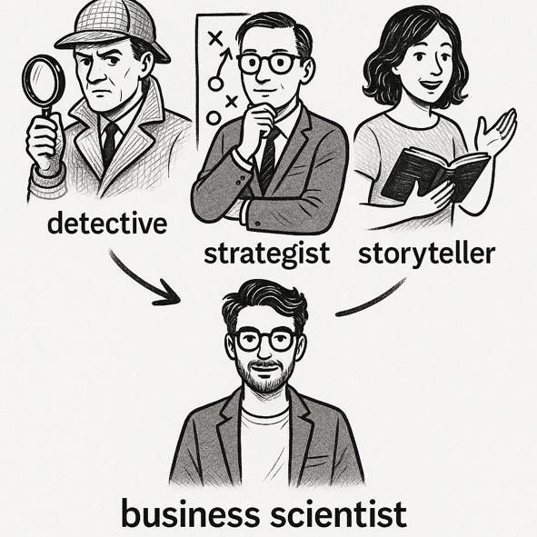
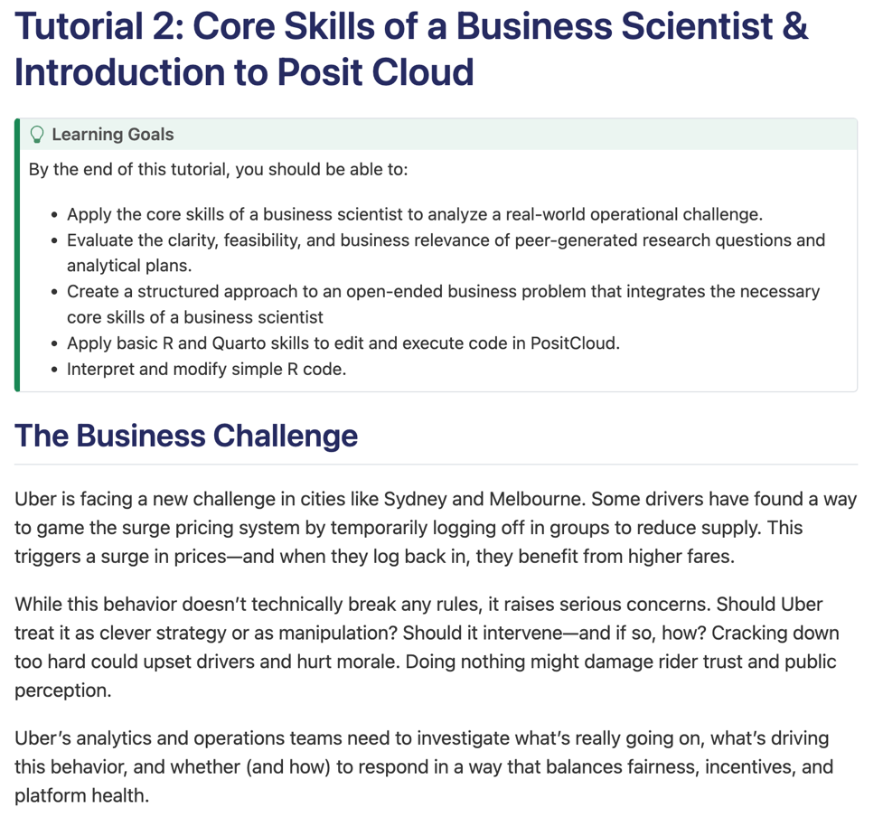
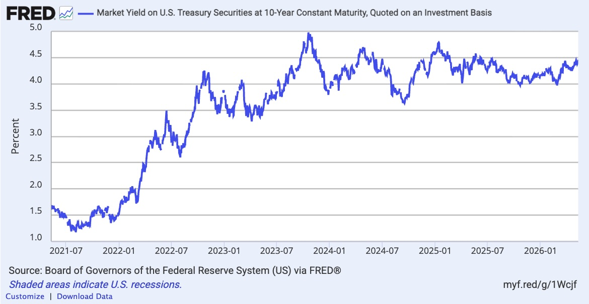
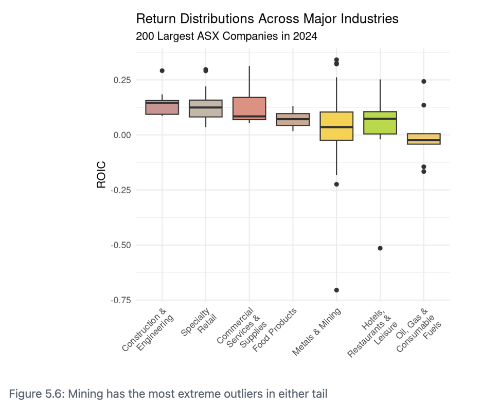
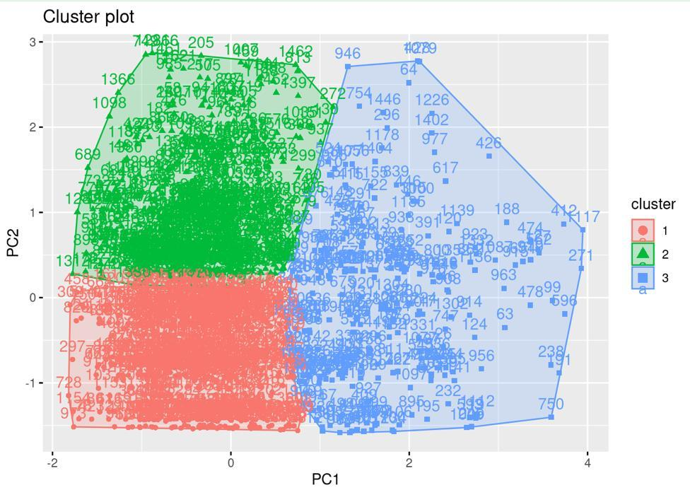
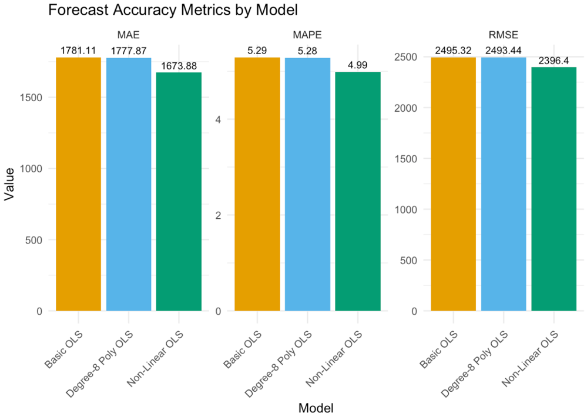
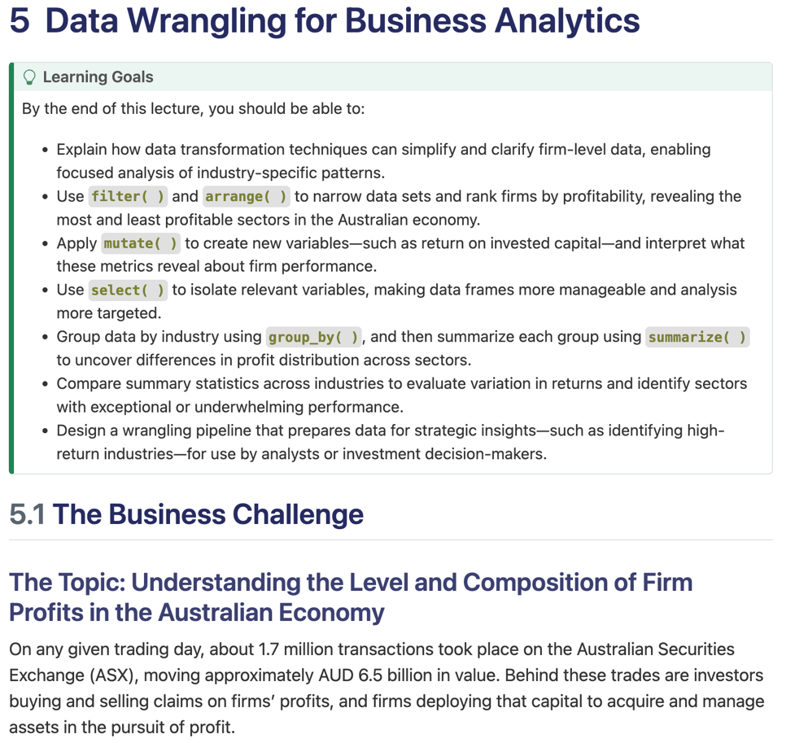
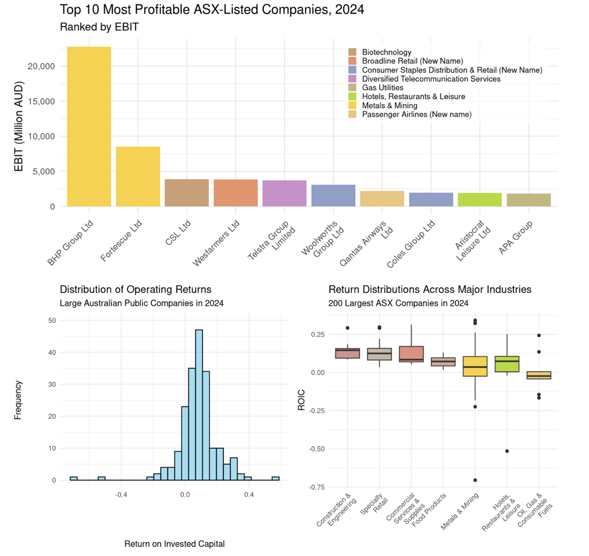
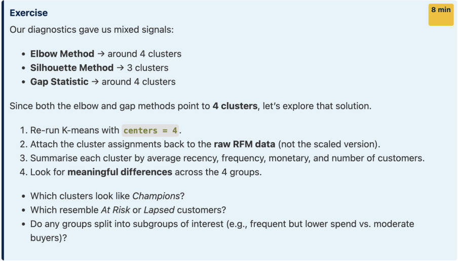

## What Is Ethics in Business Analytics?

Analytics projects do not just describe the world.

They can shape:

- what organisations notice
- who receives opportunities
- who bears risk
- what choices people are encouraged to make

> **Ethics asks whether analytics is being used in ways that are respectful, fair, accountable, and proportionate.**

## A Simple Definition

In business analytics, ethics means asking:

- Should we collect this data?
- Should we use it for this purpose?
- Could this harm people?
- Who gets to challenge the outcome?
- Are we comfortable defending this decision?

The goal is not perfect answers.  
The goal is better questions before harm occurs.

## Four Ethical Lenses

We will use four lenses:

1. **Privacy**  
   Are we using data respectfully?

2. **Bias**  
   Are outcomes unfair for some groups?

3. **Accountability**  
   Can decisions be explained and challenged?

4. **Power**  
   Who benefits, who bears risk, and who has agency?

# Lens 1: Privacy

## Privacy Is Not Just Secrecy

Privacy is about control, context, and proportionality.

Ask:

- What data is actually needed?
- Do people understand how it will be used?
- Could the data reveal something sensitive?
- Is the use reasonable in context?
- Can the organisation protect it?

## Privacy Example: Facebook and Cambridge Analytica

Facebook data was accessed through a third-party app and later used for political profiling and targeting.

Key ethical issue:

> People may have shared data for one purpose, but not expected it to be reused for political analytics.

Lesson: consent is weak if people cannot understand the future use.

## Privacy Discussion

Imagine a retailer wants to combine loyalty card, location, and web browsing data.

What would you ask before approving the project?

# Lens 2: Bias

## Bias Is Systematic Harm

Bias is not just an offensive variable in a dataset.

It can appear when an analytics system produces systematically worse outcomes for some groups.

Bias can come from:

- historical data
- proxy variables
- underrepresentation
- biased labels
- feedback loops

## Bias Example: Amazon Recruiting Tool

Reuters reported that Amazon abandoned an experimental AI recruiting tool after it learned patterns that disadvantaged women.

The tool was trained on historical hiring data from a male-dominated workforce.

Key ethical issue:

> A model trained on past decisions can learn past exclusion and make it look objective.

Lesson: "data-driven" does not automatically mean fair.

## Basic Bias Check

Before using a model, ask:

1. Who could be wrongly included?
2. Who could be wrongly excluded?
3. Are errors worse for some groups?
4. Are we using variables that proxy for protected characteristics?
5. Will we keep monitoring after launch?

## Bias Discussion

A bank uses an algorithm to approve personal loans.

What groups might be affected unfairly, and what errors would matter most?

# Lens 3: Accountability

## Accountability Means Answerability

A system is accountable when people can answer:

- Who designed it?
- Who approved it?
- Who monitors it?
- Who can override it?
- Who can challenge it?
- Who is responsible when harm occurs?

Accuracy does not remove the need for accountability.

## Accountability Example: Robodebt

Australia's Robodebt scheme used automated income averaging to raise welfare debts.

The Royal Commission described the scheme as a costly failure of public administration in both human and economic terms.

Key ethical issue:

> Automation scaled decisions that people affected by them struggled to understand, challenge, or correct.

Lesson: a system is not accountable if affected people cannot understand or dispute it.

## Accountability Checklist

Ask:

- Is there a named owner?
- Is there a real appeal path?
- Can a human override the system?
- Are errors reviewed?
- Would we know if the system started causing harm?

## Accountability Discussion

An insurer automatically rejects some claims as suspicious.

What should customers be told, and how should they challenge a decision?

# Lens 4: Power

## Analytics Changes Power Relationships

Analytics systems do more than predict behaviour.

They can shape behaviour.

They can:

- surveil people
- steer choices
- set defaults
- make some options easier than others
- make refusal difficult

Power is about who gets to decide the terms of the system.

## Power Example: Fortnite Dark Patterns

The FTC finalised an order requiring Epic Games to pay $245 million to consumers.

The FTC alleged that Fortnite used dark patterns that led players, including children, into unwanted purchases.

Key ethical issue:

> Interface design can convert attention, confusion, and impulse into revenue.

Lesson: design choices can be ethical choices.

## Nudge or Manipulation?

A nudge is more ethical when it is:

- transparent
- easy to refuse
- aligned with the person's interests

A design becomes manipulative when it exploits vulnerability, hides material information, or makes refusal costly.

## Power Discussion

Think about subscription cancellation.

Where is the line between encouraging customers to stay and trapping them?

## Wrapping Up

Ethics in business analytics is not separate from business performance.

Unethical analytics can produce:

- legal exposure
- reputational damage
- bad decisions
- loss of trust
- direct harm to people

**Takeaway:**  
The question is not only "Can we predict this?"  
It is also "Should we act on it, and under what conditions?"

## Sources

\small

- FTC, Facebook privacy settlement, 2019: `ftc.gov`
- Reuters, Amazon recruiting tool reporting, 2018
- Royal Commission into the Robodebt Scheme, 2023
- FTC, Epic Games/Fortnite order, 2023

# Appendix: Discussion Notes

## Privacy Discussion: Suggested Points

Retailer combining loyalty, location, and web browsing data:

- Is each data source necessary for the business purpose?
- Would customers expect these data sources to be combined?
- Does location reveal sensitive places or routines?
- Can customers opt out without losing the core service?
- How long is the combined profile kept?

## Bias Discussion: Suggested Points

Bank loan approval algorithm:

- Groups affected may include younger applicants, migrants, renters, carers, and people with thin credit files.
- False rejections matter because they deny access to credit.
- False approvals matter because they can create unaffordable debt.
- Check error rates across groups, not just overall accuracy.
- Watch for proxies such as postcode, employment gaps, or transaction patterns.

## Accountability Discussion: Suggested Points

Insurer automatically rejecting suspicious claims:

- Customers should be told the reason in plain language.
- They should know whether automation was used.
- There should be a clear appeal path with human review.
- The insurer should track overturned decisions.
- A named team should own monitoring and correction.

## Power Discussion: Suggested Points

Subscription cancellation:

- Ethical retention is transparent and easy to refuse.
- It is reasonable to show one clear alternative or discount.
- It becomes trapping when cancellation is hidden, delayed, or requires unnecessary contact.
- The exit path should be no harder than sign-up.
- Vulnerable users should not be pressured through fear, guilt, or confusion.

# Subject Recap

## What Is Business Analytics?

All firms face the question: **What should we do next?**

- Hold more inventory or less going forward?
- Redesign our recruitment process?
- Change suppliers?
- Raise capital via an IPO?
- Increase product prices?
- Launch a new advertising campaign?
- Roster more or fewer staff?

**Business analytics** is the use of data and analytical tools to support better decision-making.

## The Business Analytics Process

1. **Define the problem**  
   What decision needs to be made? What does success look like?

2. **Collect and clean data**  
   Gather relevant data and make it accurate, complete, and reliable.

3. **Analyse data appropriately**  
   Identify patterns, test hypotheses, and quantify trade-offs.

4. **Communicate insights**  
   Tell clear stories with data that guide action.

5. **Act to create value**  
   Use insight to improve strategy and operations.

## The Business Scientist Mindset

:::: {.columns}

::: {.column width="50%"}

To implement this process, a business scientist needs:

1. **Statistical reasoning**  
   Separate signal from noise, check assumptions, and quantify uncertainty.

2. **Technological capability**  
   Get, store, shape, and analyse data reliably and reproducibly.

3. **Business insight**  
   Translate analysis into meaningful understanding about customers, operations, and strategy.

:::

::: {.column width="46%"}

{width=100%}

:::

::::

## Institutional Detail

:::: {.columns}

::: {.column width="49%"}

To frame better questions and extract meaning from analysis, we need to understand the business world:

- customers
- competitors
- suppliers
- regulations
- how the organisation works

\vspace{1cm}

Where we applied this:

- T1: Uber as a two-sided platform
- T4: Properties of accounting measures

:::

::: {.column width="47%"}

{width=100%}

:::

::::

## Data Discovery

:::: {.columns}

::: {.column width="49%"}

Because the data we want rarely exists in the form we need, we often need to collect, clean, or reshape data from:

- spreadsheets
- databases
- APIs
- messy or incomplete sources

\vspace{1cm}

Where we applied this:

- T10: JSON and bid data
- T11: API and macro indicators

:::

::: {.column width="47%"}

\vspace{1cm}

{width=100%}

:::

::::

## Business Theory

:::: {.columns}

::: {.column width="49%"}

To explain and predict how people and firms behave, we need to think about:

- motivations
- incentives
- constraints

\vspace{0.5cm}

Business theory gives us mental models for proposing and interpreting patterns in data.

\vspace{1cm}

Where we applied this:

- L5: mining and risk
- T10: Shill bidding strategies

:::

::: {.column width="47%"}

\vspace{0.5cm}

{width=100%}

:::

::::

## Analytical Modelling

:::: {.columns}

::: {.column width="49%"}

To produce useful analysis, match the tool to the task. Ask:

- Do we need a causal estimate?
- Do we need a prediction?
- Do we need a simple, effective plot?
- Does the tool need to be interpretable?

\vspace{1cm}

Where we applied this:

- T7: k-means clustering in HRM
- T8: A/B testing in tech

:::

::: {.column width="47%"}

{width=100%}

:::

::::

## Analytical Theory

:::: {.columns}

::: {.column width="49%"}

Misleading analysis leads to bad decisions. We need to think critically about what the data really shows:

- measurement
- sampling
- alternative explanations
- assumptions
- overfitting

\vspace{0.5cm}

Where we applied this:

- L9: Model-based inference
- T9: Overfitting

:::

::: {.column width="47%"}

{width=100%}

:::

::::

## Computational Skills

:::: {.columns}

::: {.column width="49%"}

To solve data problems efficiently, we use code and robust data workflows.

Good computational practice makes analysis:

- faster
- clearer
- more reproducible
- easier to debug

\vspace{1cm}

Where we applied this:

- L5: data wrangling
- L6: shaping and combining data

:::

::: {.column width="47%"}

{width=100%}

:::

::::

## Presentation and Communication

:::: {.columns}

::: {.column width="49%"}

To help decision makers act, we shape findings into clear, purposeful stories.

Good communication uses:

- clear writing
- clean visuals
- sharp recommendations

\vspace{1cm}

Where we applied this:

- T3: data visualisation
- Assignment 

:::

::: {.column width="47%"}

{width=100%}

:::

::::

## Creativity and Judgment

:::: {.columns}

::: {.column width="49%"}

Because you will not always get a clean brief, business analysts need to act as curious, focused investigators:

- reframe vague problems
- find workable solutions
- focus on what matters
- know when analysis is good enough to support action

\vspace{1cm}

Where we applied this:

- T6: Using variation in data to tell stories
- L10: Customer segmentation

:::

::: {.column width="47%"}

\vspace{1cm}

{width=100%}

:::

::::

## What Did We Cover?

**Weeks 1-5**

1. **Foundations**
   Business analytics, business scientist skills, reproducible workflows

2. **Extracting first insights** 
   Data visualisation, manipulating data, shaping and combining data

**Weeks 6-12**

3. **Extracting deeper insights**  
   Variation, descriptive analytics, causal analytics, predictive analytics

4. **Finding and storing data**  
   Storing, using, and collecting data

5. **Ethics and privacy**
